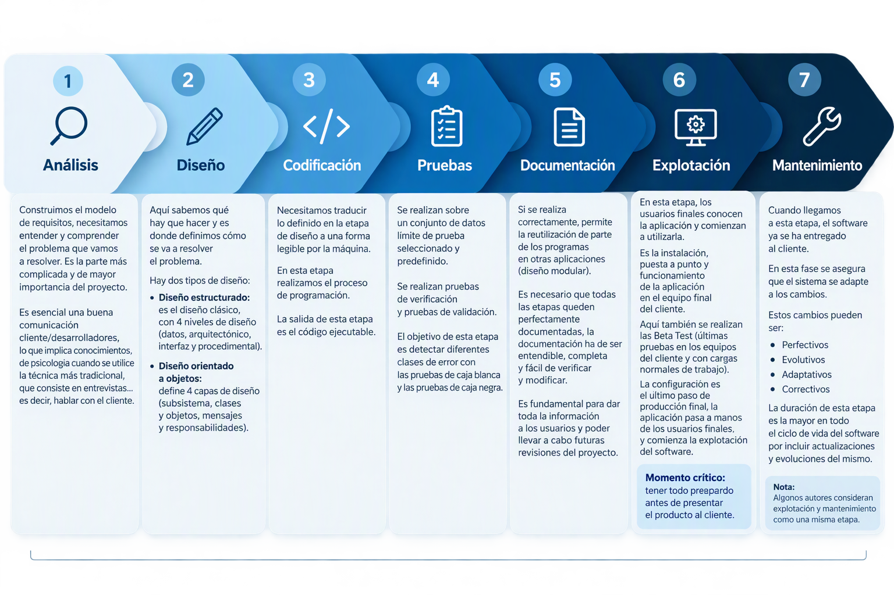

# Ejercicio 01 de Entornos de Desarrollo   

## ¿Qué es un programa informático? 

Un *programa informático* es un conjunto de instrucciones escritas en un lenguaje de programación, que una vez ejecutadas, realizan una o varias tareas en un ordenador.

## Diferencia entre código fuente, código objeto y código ejecutable.   

| Característica | Código fuente 📝 | Código objeto ⚙️ | Código ejecutable ▶️ |
|---|---|---|---|
| **Definición** | Conjunto de instrucciones escritas por los programadores en un lenguaje de alto nivel | Código intermedio en binario (unos y ceros), resultado de traducir el código fuente | Archivo único resultado de enlazar los archivos de código objeto |
| **Generado por** | El programador, con un editor de texto | El compilador (si la traducción es en un solo paso) o el intérprete (si la traducción se realiza línea a línea y se ejecuta simultáneamente) | El enlazador (linker) |
| **Legible por humanos** | Sí | No | No | 
| **Ejecutable directamente por la máquina** | No, hay que traducirlo para que la máquina lo entienda y ejecute | No | Sí, lo ejecuta y controla el sistema operativo |
| **Archivos** | Un documento con la codificación de todos los módulos, funciones, bibliotecas y procedimientos | Varios, uno por cada programa fuente compilado | Uno solo |
| **Fase del proceso** | Primera: parte de las etapas de análisis y diseño, y de un <u>algoritmo diseñado previamente en pseudocódigo</u> | Intermedia: solo se genera si el código fuente está libre de errores sintácticos y semánticos | Final: se obtiene al enlazar el código objeto |

## Etapas del desarrollo del software.   

Nos encontramos con las siguientes etapas por las que pasa el sistema desde que nace la idea inicial hasta que el software es retirado o reemplazado por otro:

1. **Análisis**: Construimos el modelo de requisitos, necesitamos entender y comprender el problema que vamos a resolver. Es la parte más complicada y de mayor importancia del proyecto. Es esencial una buena comunicación cliente/desarrolladores, lo que implica conocimientos de psicología cuando se utilice la técnica más tradicional, que consiste en entrevistas...es decir, hablar con el cliente.    
2. **Diseño**: Aquí sabemos qué hay que hacer y es donde definimos cómo se va a resolver el problema. Hay dos tipos de diseño:   
- Diseño estructurado: es el diseño clásico, con 4 niveles de diseño (datos, arquitectónico, interfaz y procedimental).
- Diseño orientado a objetos: define 4 capas de diseño (subsistema, clases y objetos, mensajes y responsabilidades).
3. **Codificación**: Necesitamos traducir lo definido en la etapa de diseño a una forma legible por la máquina. En esta etapa realizamos el proceso de programación. La salida de esta etapa es el código ejecutable.
4. **Pruebas**: Se realizan sobre un conjunto de datos límite de prueba seleccionado y predefinido. Se realizan pruebas de verificación y pruebas de validación. El objetivo de esta etapa es detectar diferentes clases de error con las pruebas de caja blanca y las pruebas de caja negra.
5. **Documentación**: Si se realiza correctamente, permite la reutilización de parte de los programas en otras aplicaciones (diseño modular). Es necesario que todas las etapas queden perfectamente documentadas, la documentación ha de ser entendible, completa y fácil de verificar y modificar. Es fundamental para dar toda la información a los usuarios y poder llevar a cabo futuras revisiones del proyecto.   
6. **Explotación**: En esta etapa, los usuarios finales conocen la aplicación y comienzan a utilizarla. Es la instalación, puesta a punto y funcionamiento de la aplicación en el equipo final del cliente. Aquí también se realizan las Beta Test (últimas pruebas en los equipos del cliente y con cargas normales de trabajo).   
La configuración es el último paso de producción final, la aplicación pasa a manos de los usuarios finales y comienza la explotación del software.   
**Momento crítico**: tener todo preparado antes de presentar el producto al cliente.   
*Nota*: Algunos autores consideran explotación y mantenimiento como una misma etapa.
7. **Mantenimiento**: Cuando llegamos a esta etapa, el software ya se ha entregado al cliente. En esta fase se asegura que el sistema se adapte a los cambios. Estos cambios pueden ser perfectivos, evolutivos, adaptativos y correctivos. La duración de esta etapa es la mayor en todo el ciclo de vida del software por incluir actualizaciones y evoluciones del mismo.   

### Enlace a [Actividad 01 de Lucía Llaneza](https://github.com/luciallaneza/1DAMVirtual_LlanezaMadera_Lucia)

